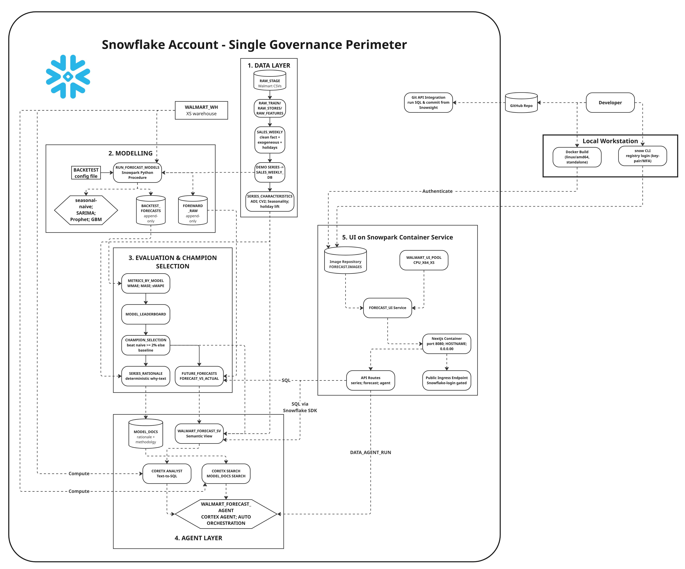

# Walmart Demand Forecasting - Snowflake Agent + Next.js UI

An end-to-end, **all-inside-Snowflake** demo: real Walmart store-department sales ->
a multi-model forecasting pipeline with deterministic champion selection -> a
Cortex Agent that explains the forecasts -> a Next.js dashboard served from
Snowpark Container Services. No data leaves the account.



## What it does
- Loads the Kaggle Walmart sales data (421k rows, 45 stores, weekly).
- On a curated 49-series subset, runs **seasonal-naive, SARIMA, Prophet, and GBM**
  (plus optional native `ML.FORECAST`), rolling-origin backtested and scored with
  **holiday-weighted WMAE** (+ MASE, sMAPE).
- Picks a **champion per series** deterministically, with a seasonal-naive
  guardrail, and writes a plain-English rationale for each choice.
- Exposes a **Cortex Agent** (Analyst over a semantic view + Search over the
  rationales) that answers forecast, accuracy, and "why this model" questions.
- Serves a **Next.js UI on SPCS** - portfolio KPIs, a per-series forecast explorer
  with prediction intervals, and an embedded agent chat.

The modeling logic was validated end-to-end against the real data before being
wrapped as a Snowpark procedure (see `snowpark/forecasting_lib.py`). In backtesting
the champion beat the naive baseline by ~14% on average (up to ~34% on smooth,
high-volume departments), with different models genuinely winning for different
series.

## Layout
```
sql/     00→07 pipeline (+04b optional native ML.FORECAST, 99 cleanup)
snowpark/ forecasting_lib.py - readable/local copy of the harness in sql/04
app/     Next.js app (App Router, TypeScript, recharts) + Dockerfile
spcs/    image repo + compute pool + service spec + build/push helper
docs/    RUNBOOK · ARCHITECTURE · DEMO_SCRIPT
data/    put the Kaggle CSVs here (train.csv, stores.csv, features.csv)
```

## Quick start
See **`docs/RUNBOOK.md`** for the full ordered steps. In short: run `sql/00`→`07`
in a worksheet (uploading the three CSVs after `00`), then build/push the UI image
and run `spcs/01`→`02`, then open the service endpoint.

You can also open this whole repo as a **Snowflake Workspace** (Projects ->
Workspaces -> From Git repository) - see the optional Git block in `sql/00_setup.sql`
- and run/commit everything from Snowsight.

## Honest caveats
- **Cortex + SPCS require a paid/self-service account** (not a bare trial) and a
  supported region. Confirm both before the demo.
- **`sql/04b` (native ML.FORECAST across backtest origins) is the one part not run
  against a live account.** It's optional and clearly marked; the four-model
  pipeline is complete without it.
- **Prophet** must be in your account's Anaconda channel to load; if `CREATE
  PROCEDURE` rejects it, drop it from `PACKAGES` and it falls back gracefully.
- **The COPY format** matches the standard Kaggle CSVs; if your download differs,
  adjust `CSV_FMT` in `sql/01`.
- **The SPCS public endpoint is Snowflake-login-gated** (not anonymous) and the
  compute pool **doesn't auto-suspend** - suspend it between demos.
- Forward forecasts carry the last observed exogenous values forward (no true
  future values exist in the dataset); the backtest uses real historical values.
